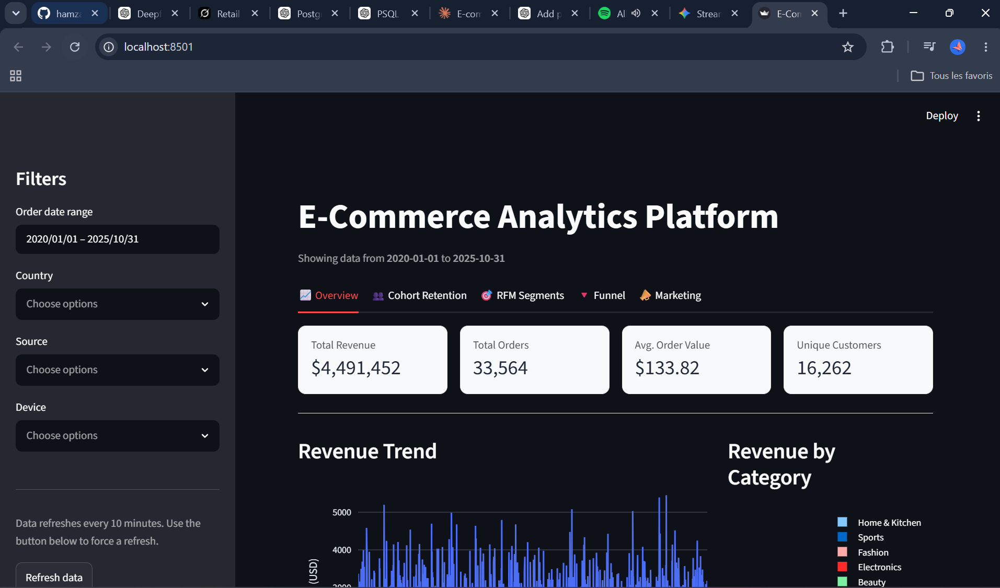
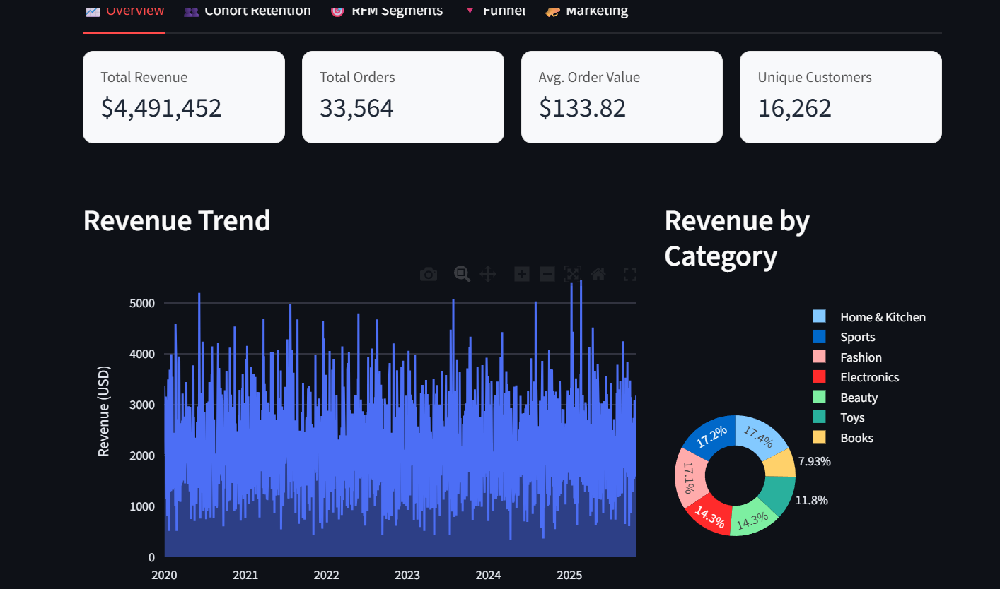
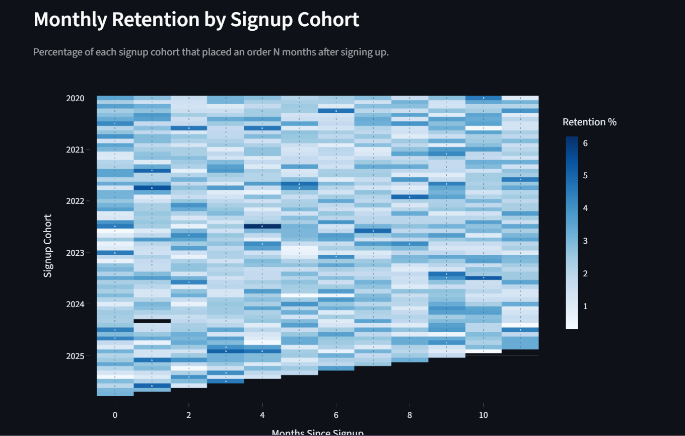
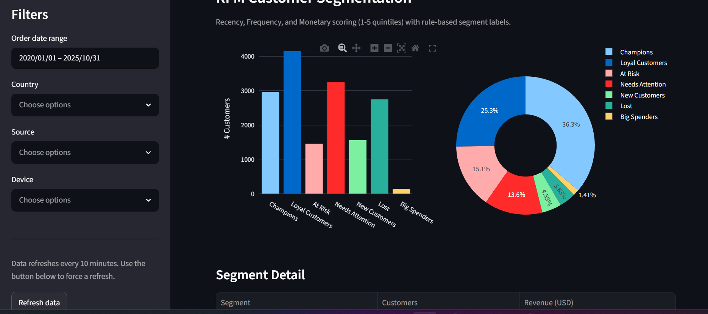
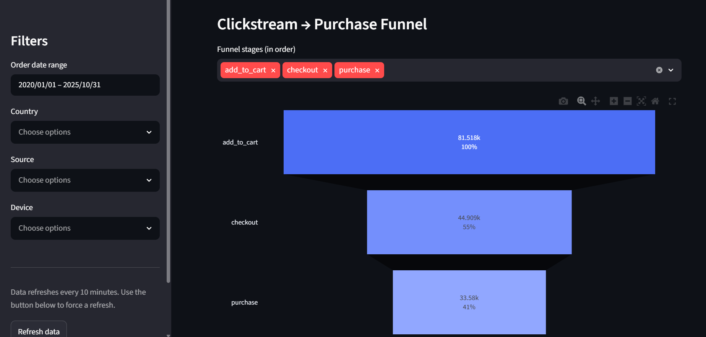
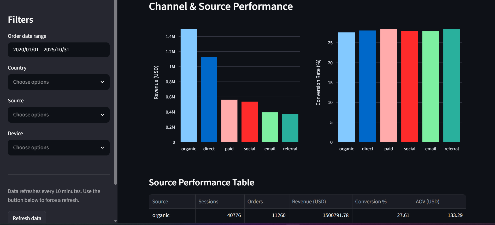

# 🛒 E-Commerce Analytics Platform

An end-to-end analytics platform that ingests raw e-commerce data (customers, sessions, orders, products, events, reviews) into PostgreSQL, transforms it with a Python ETL pipeline, analyzes it with SQL, and visualizes it through an interactive Streamlit dashboard.



---

##  Project Overview

This project simulates a real-world e-commerce analytics stack. It answers core business questions such as:

- What is our revenue, order volume, and average order value (AOV) over time?
- Which customer cohorts retain best, and how does retention decay?
- Who are our most valuable customers (RFM segmentation)?
- Where do customers drop off between browsing and purchasing (funnel analysis)?
- Which marketing channels drive the most efficient revenue?

---

##  Architecture

```
Raw CSVs  →  Python ETL (pandas)  →  PostgreSQL  →  SQL Analysis  →  Streamlit Dashboard
```

| Layer | Tool |
|---|---|
| Data storage | PostgreSQL |
| Data ingestion / cleaning | Python, pandas, SQLAlchemy |
| Analysis | SQL (window functions, CTEs) |
| Visualization | Streamlit, Plotly |

---

##  Project Structure

```
ecommerce-analytics-platform/
│
├── data/
│   └── raw/                       # Source CSV files
│       ├── customers.csv
│       ├── events.csv
│       ├── order_items.csv
│       ├── orders.csv
│       ├── products.csv
│       ├── reviews.csv
│       └── sessions.csv
│
├── sql/
│   ├── schema/
│   │   └── create_tables.sql      # Table definitions
│   └── queries/
│       ├── kpi_queries.sql
│       ├── cohort_analysis.sql
│       ├── rfm_segmentation.sql
│       ├── funnel_analysis.sql
│       └── marketing_performance.sql
│
├── src/
│   └── etl/
│       └── load_data.py           # ETL pipeline (CSV → PostgreSQL)
│
├── dashboard/
│   └── app.py                     # Streamlit dashboard
│
├── docs/
│   ├── project_report.md
│   ├── data_dictionary.md
│   ├── insights.md
│   └── screenshots/                # ← add your dashboard screenshots here
│
├── requirements.txt
└── README.md
```

---

##  Setup & Installation

### 1. Prerequisites
- Python 3.10+
- PostgreSQL 14+ (running locally or accessible remotely)
- pip

### 2. Clone / open the project folder
```cmd
cd ecommerce-analytics-platform
```

### 3. Create a virtual environment (recommended)
```cmd
python -m venv venv
venv\Scripts\activate
```

### 4. Install dependencies
```cmd
pip install -r requirements.txt
```

### 5. Create the database
```cmd
psql -U postgres -c "CREATE DATABASE ecommerce_analytics;"
```

### 6. Create the tables
Run `sql\schema\create_tables.sql` against your new database using pgAdmin or:
```cmd
psql -U postgres -d ecommerce_analytics -f sql\schema\create_tables.sql
```

### 7. Set your database credentials
Set these environment variables (or use `.streamlit\secrets.toml` for the dashboard — see the docstring at the top of `dashboard\app.py`):
```cmd
set DB_HOST=localhost
set DB_PORT=5432
set DB_NAME=ecommerce_analytics
set DB_USER=postgres
set DB_PASSWORD=your_password
```

### 8. Run the ETL pipeline
```cmd
python src\etl\load_data.py
```
This reads all 7 CSVs from `data\raw\`, cleans them, and loads them into PostgreSQL.

> 📸 **Screenshot placeholder** — capture your terminal output showing a successful ETL run.
> ``

### 9. Launch the dashboard
```cmd
streamlit run dashboard\app.py
```
Then open the local URL Streamlit prints (usually `http://localhost:8501`).

---

##  Dashboard Tabs

| Tab | What it shows |
|---|---|
| **Overview** | Revenue, orders, AOV, customer count, revenue trend, top products, category mix |
| **Cohort Retention** | Monthly retention heatmap by signup cohort |
| **RFM Segments** | Customer segmentation by Recency, Frequency, Monetary value |
| **Funnel** | Clickstream-to-purchase conversion funnel |
| **Marketing** | Revenue, conversion rate, and AOV by acquisition source |

> 📸 **Screenshot placeholders** — add one screenshot per tab:
> - 
> - 
> - 
> - 
> - 

---

##  Further Documentation

- [`docs/project_report.md`](docs/project_report.md) — full write-up of the project methodology and design decisions
- [`docs/data_dictionary.md`](docs/data_dictionary.md) — column-level definitions for every table
- [`docs/insights.md`](docs/insights.md) — key findings once the dashboard is populated with real data

---

##  Tech Stack

`Python` · `pandas` · `SQLAlchemy` · `PostgreSQL` · `SQL` · `Streamlit` · `Plotly`

---

##  License

This is a personal/portfolio project. Add a license here if you plan to share it publicly (e.g. MIT).
